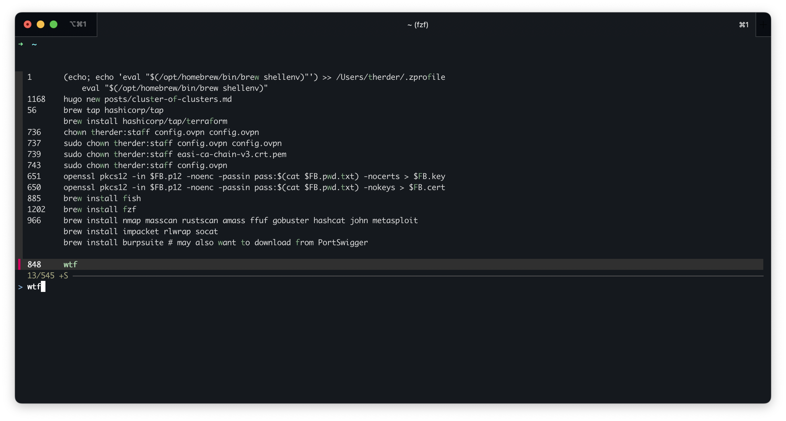
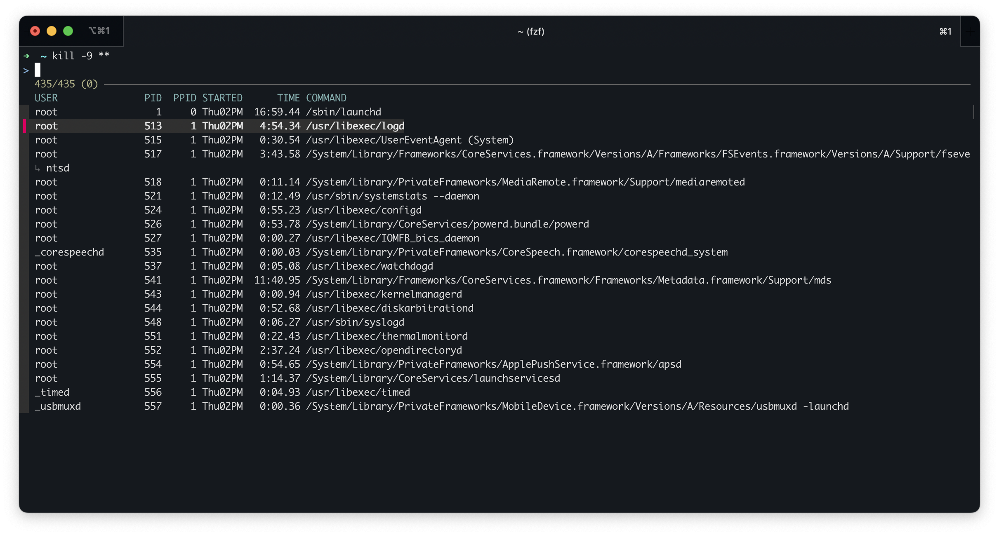
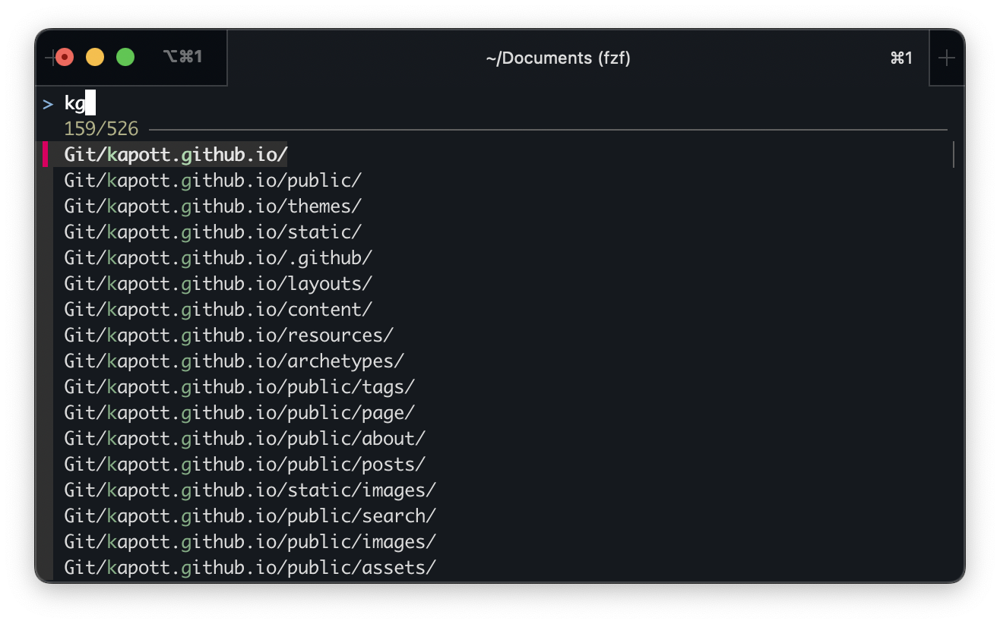

Optimizing my workflow to reduce unnecessary typing has been a game-changer, enhancing both my productivity and my connection to the tools I rely on. I tend to use whatever machine I work on like it's an extension of my body - and thus I like to remove any cognitive friction when using it, allowing my feeling of flow to continue, uninterrupted.

Below I'll first introduce you to a few simple tools. Then I'll share some tips and aliases that can make your life a lot easier.

### z
This tool makes use of a "frecency" algorithm, a combination of frequency-of-use of a directory and how recent a directory was navigated to - combined with a pseudo-fuzzy search. Sound confusing? Here's how it works once you've used it a couple of times:

```bash
therder@pig:~$ z kap  
therder@pig:~/Documents/Git/kapott.github.io$ z dow  
therder@pig:~/Downloads$
```

Once you get used to it, it'll probably replace "cd" for you. (I've aliased it to "cd").

Get it here:
[z for bash](https://github.com/rupa/z) | [z for zsh](https://github.com/agkozak/zsh-z) | [z for fish](https://github.com/jethrokuan/z)

Combine this with autocomplete in zsh or fish to view the prediction `z` is making for you - this will cement it's position as a reliable tool in your brain, meaning you'll accept it as a "normal thing" in your workflow - only noticing it when it's not there.

## atool

One tool to manage all your archives. Tarballs, zipfiles, rar files, jar files - you name it. This tool works with it.
Tired of remembering what flags to use for tar? Don't know if you installed rar for that file you need to unpack? Don't worry, [atool](https://manpages.debian.org/testing/atool/als.1.en.html) has got your back.

Just `alias x="atool --extract"`. Now `x file.tar.gz` or `x file.rar` or `x file.7z` will unpack whatever file you give it into a subdirectory - unless it's a single file, then it'll put it in the current directory, unless it overwrites a file with the same name.

Atool is the abstraction `apack`, `aunpack`, `als`, `acat`, `adiff` and `arepack` and uses these tools to manipulate archives of all kinds. No more remembering the difference between the gz flags and the zip flags. Just `atool` all the things.

Read more about atool on [the atool man page](https://manpages.debian.org/testing/atool/als.1.en.html).

Sidenote;
the mnemonic for `.tar.gz` file management I use is still "tar compress ze vucking files", `tar cvf files.tar.gz ...` and "tar extract ze vucking files", `tar xzvf filename.tar.gz`. For those times you're on a prod server and you can't install `atool` ;)

### fzf
I type at around a comfortable \~120 words per minute and sometimes I make typo's. 

Fuzzy search doesn't care. With fuzzy search I can search for "\~/zrc" and it'll open my \~/.zshrc in vim without batting an eye.

Although this tool is much more powerful than what I'm using it for, even my basic usecase makes it such a lifesaver. 

Some usecases from my daily workflow:

Going through my history with \<ctrl\>-rto find that one command: `<ctrl-r>`\


Using fzf to kill a process: `kill -9 **<tab>`\


Using it for dirs not indexed by `z` from my home dir with \<Alt\>-c:



And a host of other uses which I'll probably explain in another blogpost, as fuzzy search makes every workflow, script and alias which should open something you want to quickly find a breeze.

Get fzf, the fuzzy finder here: [fzf repository on github](https://github.com/junegunn/fzf)

Come to think of it, I need to put "learning more about fzf" on my todo list. Stay tuned for an article about it soon-ish. Maybe.

## vim
The legend. Combined with both fzf and a tool called ripgrep this thing turns into a powerhouse pseudo-IDE. There's just too much to learn, and I'll probably share some cool tricks with vim in the future.

Vim is an acquired skill though, with a low barrier of entry and a very high skillcap. It you're not using it right now, I can recommend picking it up - it will transform the way you think about editing text.

My recommendations for learning vim:
Book: Practical Vim | http://vimcasts.org/ | [Writing habits, by the author of vim](https://www.moolenaar.net/habits.html)

## aliases and functions
every single-letter on the keyboard has aliases attached to them - some examples:
```bash
alias c="curl -qL --insecure"
alias d="docker"
alias g="git"
alias k="kubectl"
alias l="ls -alHz"
alias n="nmap -F -O"
alias o="openssl s_client -showcerts -connect"
alias p="podman"
alias s="systemctl"
alias t="talosctl"
alias u="apt update && apt full-upgrade -y && apt autoremove"
alias x="atool --extract"
```
Sometimes expanding these aliases to two or three letters:
```bash

# new empty temp profile, disposable browser sessions
alias fx="firefox --new-instance --profile $(mktemp -d)"
alias cx="chromium --user-data-dir $(mktemp -d)"

#systemctl most used
alias sst="systemctl status"
alias sss="systemctl start"
alias ssh="systemctl stop"

#things I type too much
alias sfl="journalctl -fu"
alias dps="docker ps -a"
alias dpu="docker compose pull && docker compose up -d --force-recreate"
alias tmux="tmux attach || tmux new"

#some useful misc
alias fuck='sudo "$SHELL" -c "$(history -p !!)"'
alias wherewasi="find . -type f -print0 | xargs -0 stat -f '%m :%Sm %N' | sort -nr | cut -d: -f2- | head -n 20" # BSD/macos
alias wherewasi="find . -type f -print0 | xargs -0 stat --format '%Z :%z %n' | sort -nr | cut -d: -f2- | head -n 20" # Linux GNUTools
```

Or adding a number as postfix  for variants which make sense - nmap, for example. `n` is fast scan of the top 100 ports. When I want to scan a single host and use host detection, service detection and scan every port, I'll use `n1` - which has the mnemonic "nmap a single host completely"

```bash
alias n1="nmap -p- -sC -sV -vv"
```

I'll be honest. I often forget a lot of these aliases if I don't use them every day. This is also why I want my rc files to be portable - that way I can auto-copy them to whatever server I connect to via ssh. Which brings me to..

## Auto copy bashrc files to servers I ssh to

Whenever I ssh into a server, I upload the most recent version of my bashrc to the server. Sometimes I don't want this, for example when I log into a client's prod server, so I made it toggleable.

Throw this snippet in your \~/.bashrc:

```bash
export SSHSYNC_ENABLED=1

alias sshsync_toggle='if [ "$SSHSYNC_ENABLED" = "1" ]; then SSHSYNC_ENABLED=0; echo "sshsync uit"; else SSHSYNC_ENABLED=1; echo "sshsync aan"; fi'

ssh_func() {
  if [ "$SSHSYNC_ENABLED" = "1" ]; then
    scp ~/.bashrc "$1:~/.bashrc" >/dev/null 2>&1
  fi
  command ssh "$@"
}
alias ssh=ssh_func
```

Now each time you `ssh` into a machine, your config gets copied onto the machine.  Mind you that the config will only be used the _next_ time you log in, so f you've made some big changes and you're not seeing them on the remote machine, relog.

Toggle the behavior by calling `sshsync_toggle` on the commandline.

## Scripts and functions
I won't get too indepth here, but if it doesn't fit into an alias - I'll throw it into a function. If  I need some more logic, it'll become a script. 

Over time, I've accumulated scripts for so many things I don't even want to list them all here. My advice? Get good at writing scripts. Write them every time you have to build some verbose commandline, chain some abstract commands together -- that one-off openssl command for example... Don't *just* use them for repetitive tasks, use them for long commands, use them for convoluted, complex or weird commands. Everything that doesn't "immediately stick in your brain".

